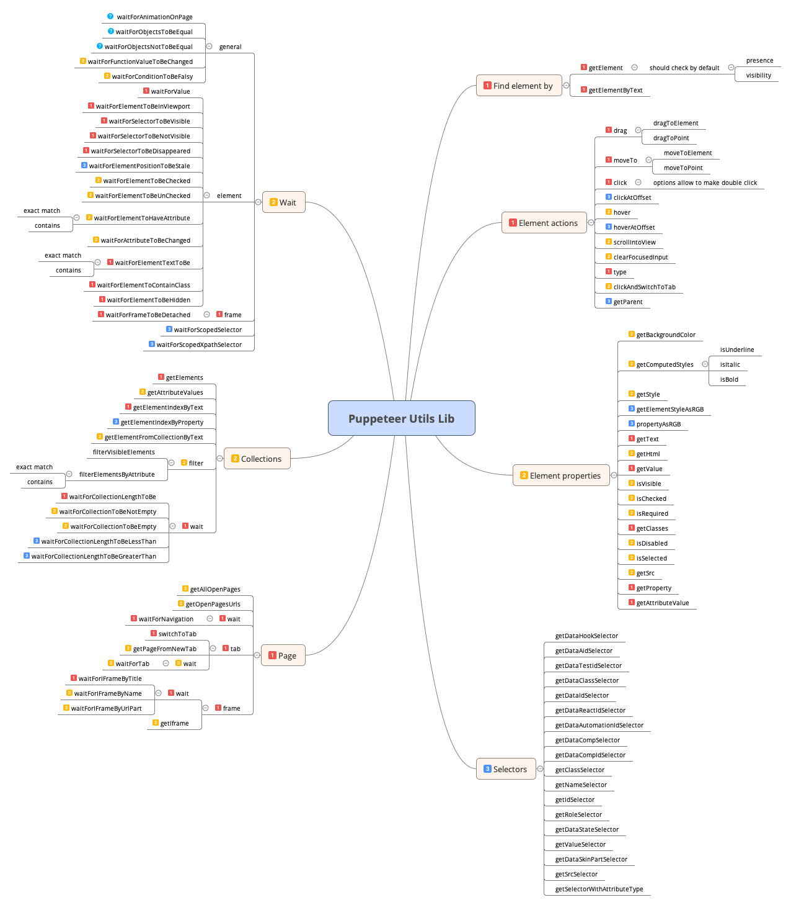

# Bubayi - Puppeteer wrapper library

Table of Contents

- [1. Intro](#1-intro)
- [2. Requirements](#2-requirements)
- [3. Proposed API](#3-proposed-api)
- [4. Question to Discuss. Import Declaration](#4-question-to-discuss-import-declaration)
  - [Version 1. All method exports are available on the top level](#version-1-all-method-exports-are-available-on-the-top-level)
  - [Version 2. Methods are divided by namespaces](#version-2-methods-are-divided-by-namespaces)
  - [Version 3. Full-path import](#version-3-full-path-import)
- [5. Question to Discuss. Method overload](#5-question-to-discuss-method-overload)
  - [Version 1. Create two separate functions with different names](#version-1-create-two-separate-functions-with-different-names)
  - [Version 2. Create one unified method that gets both params](#version-2-create-one-unified-method-that-gets-both-params)
  - [Version 3. Create method override](#version-3-create-method-override)
- [6. Question to Discuss. Lib structure](#6-question-to-discuss-lib-structure)
  - [Version 1. Everything under the separate namespace](#version-1-everything-under-the-separate-namespace)
  - [Version 2. All similar methods in one file](#version-2-all-similar-methods-in-one-file)
  - [Version 3. Everything in the root dir (similar to lodash)](#version-3-everything-in-the-root-dir--similar-to-lodash-)
- [7. Question to Discuss. Where to put tests](#7-question-to-discuss-where-to-put-tests)
  - [Version 1. Near the implemented functions](#version-1-near-the-implemented-functions)
  - [Version 2. On the src folder level](#version-2-on-the-src-folder-level)

## 1. Intro

The goal of the project is to implement the library over raw Puppeteer methods in order to simplify their usages and provide a unified approach how to deal with basic cases, like waiting for some conditions, clicking on the elements, getting text value, etc. It should reduce the code duplication among the repositories that implement such methods on their own and improve the test stability by using the best practices for generic methods.

## 2. Requirements

- provide the unified methods to find the element that considers its visibility and presence
- provide the methods to interact with the element (click, hover, type, drag, etc)
- provide the methods to perform interaction by passing a selector (click, hover, type, drag, etc)
- provide the methods to get element attributes/properties data (getText, isVisible, getClasses, etc)
- provide the methods to work with tabs and frames (waitForTab, waitForFrameByName, waitForFrameByTitle, etc)
- provide the methods to work with collections of elements (waitForCollectionLengthToBeGreaterThan, waitForCollectionToBeEmpty, getElements, etc)
- provide the methods to wait for some condition (waitForSelectorToBeNotVisible, waitForElementToContainClass, waitForFrameToBeDetached, etc)

## 3. Proposed API

See the mind map with the suggested methods


## 4. Question to Discuss. Import Declaration

### Version 1. All method exports are available on the top level

```js
import { click } from 'bubayi';

describe('Sample test', () => {
  it('should click on the button to add new element', async () => {
    await page.goto('http://the-internet.herokuapp.com/add_remove_elements/');
    await click(page, "[onclick = 'addElement()']");
    expect(await page.$$("[onclick = 'deleteElement()']")).toHaveLength(1);
  });
});
```

### Version 2. Methods are divided by namespaces

```js
import { click } from 'bubayi/element';

describe('Sample test', () => {
  it('should click on the button to add new element', async () => {
    await page.goto('http://the-internet.herokuapp.com/add_remove_elements/');
    await click(page, "[onclick = 'addElement()']");
    expect(await page.$$("[onclick = 'deleteElement()']")).toHaveLength(1);
  });
});
```

### Version 3. Full-path import

```js
import { click } from 'bubayi/element/actions';

describe('Sample test', () => {
  it('should click on the button to add new element', async () => {
    await page.goto('http://the-internet.herokuapp.com/add_remove_elements/');
    await click(page, "[onclick = 'addElement()']");
    expect(await page.$$("[onclick = 'deleteElement()']")).toHaveLength(1);
  });
});
```

## 5. Question to Discuss. Method overload

There are two ways of using the element `click` method (and similar ones):

- pass the selector inside the function `click` where the element will be found and the click action will be performed
- pass the element itself to the function `click` where the click action will be performed after some verifications for the availability

### Version 1. Create two separate functions with different names

```js
export async function click(
  context: Page | Frame,
  selector: string,
  options?: ClickOptions,
) {
  const element = await getElement(context, selector);
  // some methods to ensure that the element is clickable and visible
  await element.click(options);
}

export async function clickOnElement(
  context: ElementHandle,
  options?: ClickOptions,
) {
  // some methods to ensure that the element is clickable and visible
  await context.click(options);
}
```

### Version 2. Create one unified method that gets both params

```js
export interface SelectorElement {
  context: Page | Frame;
  selector: string;
}

export async function click(
  selectorOrElement: SelectorElement | ElementHandle,
  options?: ClickOptions,
) {
  if (selectorOrElement instanceof ElementHandle) {
    // some methods to ensure that the element is clickable and visible
    return await selectorOrElement.click(options);
  }
  const element = await getElements(
    selectorOrElement.context,
    selectorOrElement.selector,
  );
  // some methods to ensure that the element is clickable and visible
  return await element.click(options);
}
```

### Version 3. Create method override

```js
interface MyElement {
    selector: string;
};

interface Page {
    title: string;
};

function isPageTypeGuard (page: any): page is Page {
    return 'title' in page ? true : false;
}
function isElementTypeGuard(element: any): element is MyElement {
    return 'selector' in element ? true : false;
}

function click(selector: string, context: Page, options?: ClickOptions): void
function click(element: MyElement, options?: ClickOptions): void
function click(selector: any, context?: any, options?: ClickOptions){
    if( typeof selector === 'string' && isPageTypeGuard(context)){
        console.log("Click on the page");
    }
    else if (isElementTypeGuard(selector)){
        console.log("Click on Element");
    }
}
```

## 6. Question to Discuss. Lib structure

### Version 1. Everything under the separate namespace

```
- src
  - element
    - actions
      - click.ts
      - drag.ts
    - waits
      - waitForSelectorToBeNotVisible
```

### Version 2. All similar methods in one file

```
- src
  - element
    - actions.ts (export click, drag, etc)
    - waits.ts (export waitForSelectorToBeNotVisible, etc)
  - collection
    - waits.ts
```

### Version 3. Everything in the root dir (similar to lodash)

```
- src
  - drag.ts
  - click.ts
  - waitForSelectorToBeNotVisible.ts
- tests
```

## 7. Question to Discuss. Where to put tests

### Version 1. Near the implemented functions

```
- src
  - element
    - actions
      - tests
         - click.spec.ts
         - drag.spec.ts
      - click.ts
      - drag.ts
```

### Version 2. On the src folder level

```
- src
  - element
    - actions
      - click.ts
      - drag.ts
- tests
  - element
    - actions
      - click.spec.ts
      - drag.spec.ts
```
